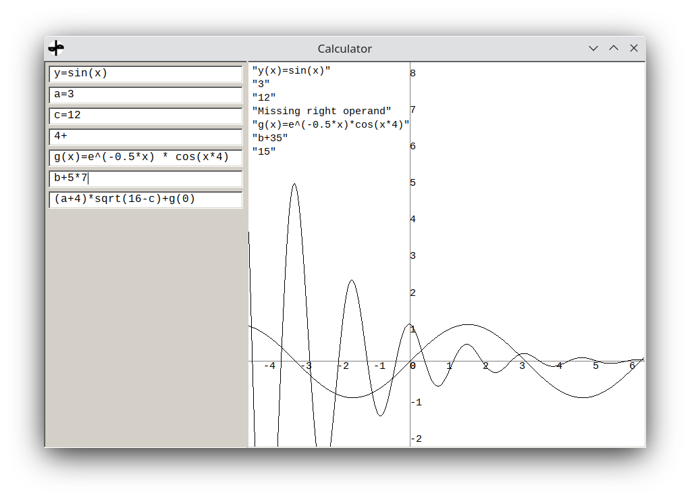
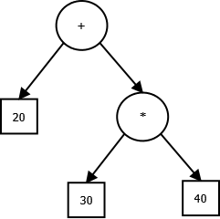

# Calculator
This is my highschool exam project (Swedish "gymnasiearbete").

The calculator can:

* Perform basic arithmetic operations
* Use variables
* Use predefined and user-defind functions
* Draw graphs
* Almost perform algebraic operations
* Crash when you are doing something important

The program translates the text expression to a tree and then recursively evaluates the tree.

The image above is the tree for 20+30*40
